## {background-image="./Figures/Title_Page_Thesis.png"}

# Preamble

<!-- Nota: Considerar que cada parte, de las 5 principales ("Introduction" to "Implementations") pueden tener una dedicación de 10 minutos de media.-->

## Thesis Goals {.smaller}

In this thesis, three main objectives guide its development:

::: {.fragment-container}
<ul>
<li>to develop procedures for <strong>updating and sharing information across models</strong>, </li>
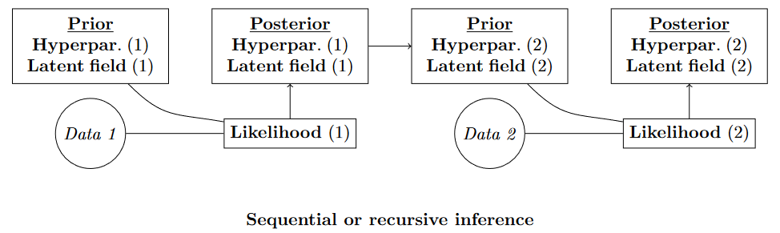{.fragment .fade-in-then-out .absolute top="250" right="200" width="800" height="320"}
{.fragment .fade-in .absolute top="465" left="0" width="400" height="160"}
<li>to address <strong>spatio-temporal</strong> modelling within <strong> compositional data</strong>, </li>
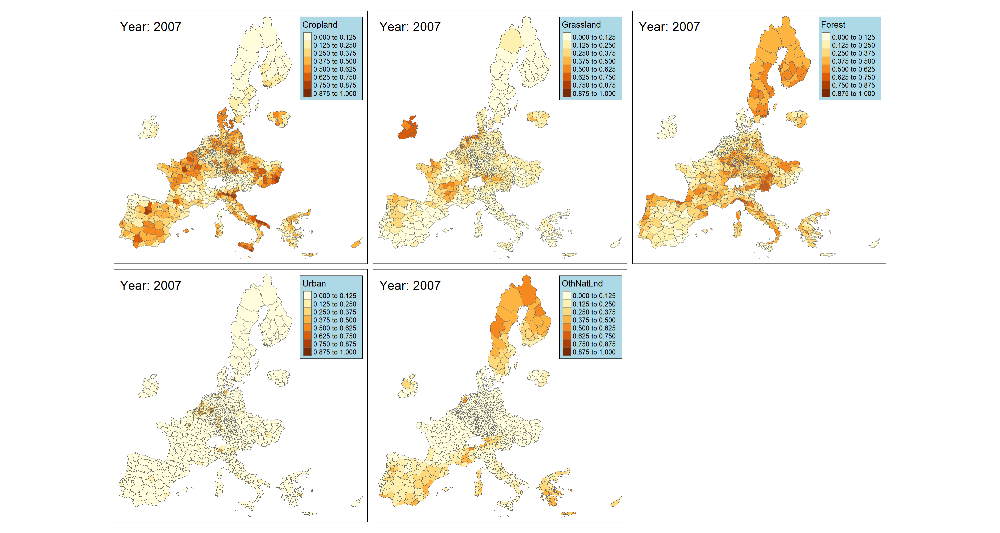{.fragment .fade-in-then-out .absolute top="50" right="75" width="1200" height="700"}
{.fragment .fade-in .absolute top="425" left="410" width="500" height="250"}
<li>and to <strong>design algorithms</strong> capable of overcoming <strong>big-data</strong>  computational challenges. </li>
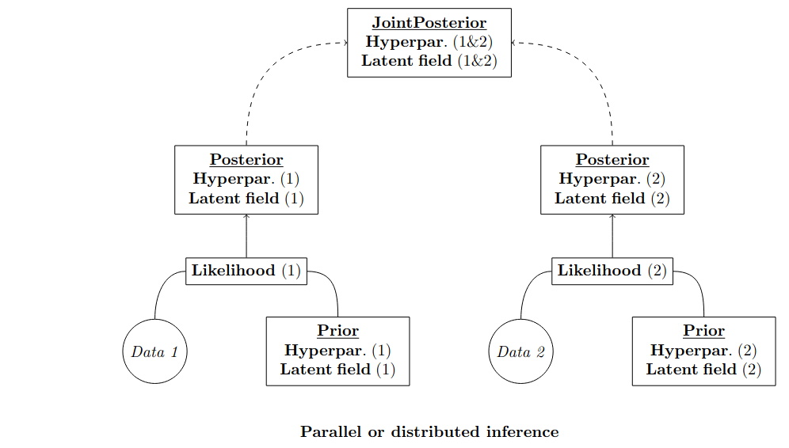{.fragment .fade-in-then-out .absolute top="50" right="100" width="1200"}
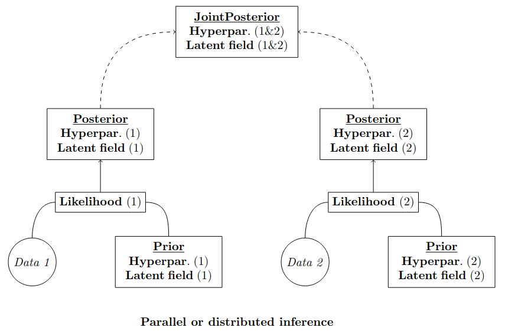{.fragment .fade-in .absolute top="400" left="900" width="370" height="300"}
</ul>
:::

::: {.fragment .fade-in}
The developments in these topics are based on the INLA (*Integrated Nested Laplace Approximations*) method.
:::

# Outline

## {.smaller}

<!-- Note: En esta exposición no se hace recorrido cronológico de la formación de los artículos sino un recorrido sistemático del trabajo. -->

- Introduction
  - Bayesian Inference
  - INLA
  - Spatio-temporal models
  - Dealing with high complexity

. . .

- Updating model information
  - Bayesian Feedback
  - Sequential Consensus

. . .

- Distributed and Recursive Inference
  - Distributed Inference (DI)
  - Recursive Inference (RI)
  - Partitioning model structures

. . .

- Implementations
  - BAYSPINS
  - Challenges in Spatio-Temporal Modeling of CoDa 
  - Sequential update with change of support
    - Expert knowledge
    - Compositional Data (CoDa)

. . .

- Conclusions and future research lines

. . .

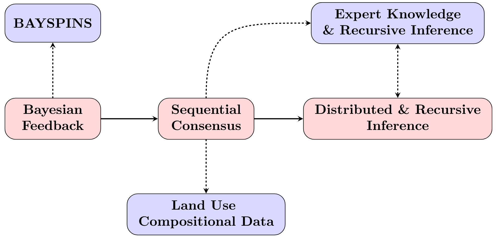{.absolute top="115" left="520" width="750"}

# Introduction

## Bayesian inference

Bayesian inference is one the two main approaches to perform statistical inference. It is grounded in the Bayes' theorem:

\begin{equation}
\pi(\boldsymbol\xi, \mathbf{y}) = \pi(\mathbf{y} \mid \boldsymbol\xi) \pi(\boldsymbol\xi) = \pi(\boldsymbol\xi \mid \mathbf{y}) \pi(\mathbf{y}) \Rightarrow \boxed{\pi(\boldsymbol\xi \mid \mathbf{y}) = \frac{\pi(\mathbf{y} \mid \boldsymbol\xi) \pi(\boldsymbol\xi)}{\pi(\mathbf{y})}},
\end{equation}
where $\pi(\xi \mid \mathbf{y})$ is the **posterior distribution** of the model parameters $\xi$, $\pi(\mathbf{y} \mid \boldsymbol\xi)$ is the likelihood, $\pi(\xi)$ is the **prior distribution** of the model parameters and $\pi(\mathbf{y})$ is the **marginal likelihood** ($\pi(\mathbf{y}) = \int_{\xi} \pi(\mathbf{y} \mid \boldsymbol\xi)\pi(\boldsymbol\xi)d\boldsymbol\xi$).

. . .

However, **behind such an apparently simple expression lies a remarkably rich and elegant collection of perspectives**, together with the theoretical foundations that constitute the underlying substrate of this theorem.  

## Bayesian inference

It may seems that a straight possibility is to just solve analitically the previous equation, but nothing fardest from reality, as only some simple (toy) models can be truelly solve in this way, due to the difficulty of calculate the marginal likelihood $\pi(\mathbf{y})$.

. . .

Therefore, within the Bayesian framework, several methods are available for inferring the parameters $\boldsymbol{\xi}$, including:

- Monte Carlo (MC) methods, 
- Markov Chain Monte Carlo (MCMC), 
- Adaptive Gaussian--Hermite Quadrature (AGHQ), 
- Variational Inference (VI), and 
- **Integrated Nested Laplace Approximations** (INLA).

## INLA

- INLA is an ad hoc method, focused on obtaining the marginal posterior distributions of the latent field ($x_i$) and the hyperparameters ($\theta_i$):

\begin{equation}
\begin{array}{c}
\pi(\theta_i \mid \mathbf{y}) = \int_{\boldsymbol\theta_{-i}\in \boldsymbol\Theta}\int_{\mathbf{x} \in \mathbf{X}} \pi(\mathbf{x}, \boldsymbol\theta \mid \mathbf{y}) d\mathbf{x}d\boldsymbol\theta_{-i}, \\
\pi(x_i \mid \mathbf{y}) = \int_{\boldsymbol\theta \in \boldsymbol\Theta} \int_{\mathbf{x}_{-i} \in \mathbf{X}} \pi(\mathbf{x}, \boldsymbol\theta \mid \mathbf{y}) d\mathbf{x}_{-i}d\boldsymbol\theta.
\end{array}
\end{equation}

- It is focused for hierarchical models with latent Gaussian fields. Therefore, we usually have the following structure for models in INLA:

\begin{equation}
\begin{array}{c}
y_i \mid \mathbf{x}, \boldsymbol\theta \sim \ell(\mu_i, \boldsymbol\theta_1),\\
\mathbb{E}(y_i) = \mu_i = g^{-1}(\eta_i)=g^{-1}(\mathbf{A}_i\mathbf{x}),\\
\mathbf{x} \mid \boldsymbol\theta_2 \sim GMRF(\boldsymbol\mu, \mathbf{Q}(\boldsymbol\theta_2)),\\
\boldsymbol\theta \sim \pi(\boldsymbol\theta_1, \boldsymbol\theta_2).
\end{array}
\end{equation}

## INLA

- To achieve this INLA uses a deterministic exploration with a quadrature rule to compute the marginal of the latent field, along with another key strategies to compute the marginal of the hyperparameters. For the joint marginal of the hyperparameters INLA uses the following functional form, evaluated at the mode of conditional posterior of the latent field:

\begin{equation}
\tilde{\pi}(\boldsymbol\theta \mid \mathbf{y}) = \left.\frac{\pi(\mathbf{y} \mid \mathbf{x}, \boldsymbol\theta) \pi(\mathbf{x} \mid \boldsymbol\theta) \pi(\boldsymbol\theta)}{\tilde{\pi}_G(\mathbf{x} \mid \boldsymbol\theta, \mathbf{y})}\right|_{\mathbf{x} = \mathbf{x}^*(\boldsymbol\theta)}.
\end{equation}

- And for the marginal of the latent field INLA uses a quadrature rule to approximate the integration:

\begin{equation}
\pi(x_i \mid \mathbf{y}) = \iint\pi(x \mid \boldsymbol\theta, \mathbf{y}) \pi(\boldsymbol\theta \mid \mathbf{y}) d\mathbf{x}_{-i}d\boldsymbol\theta \approx \sum_{k=1}^K \tilde{\pi}(x_i \mid \boldsymbol\theta^k, \mathbf{y}) \tilde{\pi}(\boldsymbol\theta^k \mid \mathbf{y})\Delta_k.
\end{equation}

---

## INLA {.smaller}
### Conditional posterior of the latent field

The conditional posterior of the latent field is computed as the Gaussian approximation at the mode of the true conditional posterior:

\begin{equation}
\tilde{\pi}_G(\mathbf{x} \mid \mathbf{y}, \boldsymbol\theta) = C(\mathbf{y}, \boldsymbol\theta) \exp\left[ (\mathbf{x} - \mu(\mathbf{y}, \boldsymbol\theta))^\top \mathbf{Q}(\mathbf{y}, \boldsymbol\theta) (\mathbf{x} - \mu(\mathbf{y}, \boldsymbol\theta)) \right],
\end{equation}

where $\mu(\mathbf{y}, \boldsymbol\theta)$ is the mean of the Gaussian approximation at the mode ($\mathbf{x}^*$) of the true posterior, and $\mathbf{Q}(\mathbf{y}, \boldsymbol\theta)$ is the negative Hessian at the mode. 

- Mean of the Gaussian approximation of the conditional posterior:

$$
\mu(\mathbf{y}, \boldsymbol\theta) = \mathbf{x}^*= \arg\min_{x}\left\{ - \log\pi(\mathbf{y} \mid \mathbf{x}, \boldsymbol\theta) - \log\pi(\mathbf{x} \mid \boldsymbol\theta) \right\}.
$$

- Precision matrix of the Gaussian approximation:

$$
\mathbf{Q}(\mathbf{y}, \boldsymbol\theta) = \mathbf{Q}(\boldsymbol\theta) - \left[\mathbf{A}^\top \frac{\partial^2 \log\pi(\mathbf{y} \mid \boldsymbol\eta, \boldsymbol\theta)}{\partial \boldsymbol\eta^2} \mathbf{A} \right]_{\boldsymbol\eta = \mathbf{A}\mathbf{x}^*}.
$$

## INLA {.smaller}
### Joint marginal posterior of hyperparameters

The joint marginal posterior of the hyperparameters is one of the main components that we need in the INLA approach, as we need to compute the modal configuration of the joint marginal posterior of the hyperparamters to build a integration scheme for the marginal of the latent field.

The formula to compute the posterior (and the configuration) of the joint marginal posterior is, as stated before, 
$$
\tilde{\pi}(\boldsymbol\theta \mid \mathbf{y}) = \left.\frac{\pi(\mathbf{y} \mid \mathbf{x}, \boldsymbol\theta) \pi(\mathbf{x} \mid \boldsymbol\theta) \pi(\boldsymbol\theta)}{\tilde{\pi}_G(\mathbf{x} \mid \boldsymbol\theta, \mathbf{y})}\right|_{\mathbf{x} = \mathbf{x}^*(\boldsymbol\theta)}.
$$

Therefore, using this equation we can compute the modal configuration by *finite differences*, as the analytical expression for this equation is not generally available:

$$
\boldsymbol\theta^* = \arg \min_{\boldsymbol\theta} \left\{-\log \pi(\mathbf{y}\mid \mathbf{x}, \boldsymbol\theta) -\log\pi(\mathbf{x} \mid \boldsymbol\theta) -\log\pi(\boldsymbol\theta) + \tilde{\pi}_G(\mathbf{x}\mid \mathbf{y}, \boldsymbol\theta) \right\}_{\mathbf{x}=\mathbf{x}^*(\boldsymbol\theta)},
$$

where $\mathbf{x}^*$ is the mode of the conditional posterior of the latent field for each $\boldsymbol\theta$ set of values.

## INLA {.smaller}
### Marginal posterior of the latent field

The marginal posterior distribution for each latent field node ($\pi(x_i \mid \mathbf{y})$) is computed by the following expression:
$$
\tilde{\pi}(x_i \mid \mathbf{y}) = \sum_{k=1}^K \tilde{\pi}(x_i \mid \boldsymbol\theta^k, \mathbf{y}) \tilde{\pi}(\boldsymbol\theta^k \mid \mathbf{y}) \Delta_k,
$$
where $\Delta_k$ is the weight from the integration scheme for each support point $\theta^k$, $\tilde{\pi}(\boldsymbol\theta^k \mid \mathbf{y})$ is the joint marginal posterior computed previously, and $\tilde{\pi}(x_i \mid \mathbf{y}, \boldsymbol\theta^k)$ is the most delicate quantity to calculate.

The following strategies are proposed to compute this quantity in the INLA methodology:

- marginalized the Gaussian approximation of the conditional posterior at the mode,
- apply a Laplace approximation for each node,
- use a simplified Laplace approximation (a Taylor expansion of 3rd order), or
- use the Gaussian approximation with a Variational Bayes (VB) correction of the mean.

Once we have computed all these quantities we can calculate goodness-of-fit measures like DIC, WAIC, CPO, etc.

## INLA {.smaller}
### Marginal posterior of hyperparameters

The marginal posterior of the hyperparameters can be computed following several different strategies. Some of them are:

  - Marginalized a Gaussian approximation around the mode of the joint marginal posterior.
  - Numerical integration using a exploration grid and interpolation.
    - Direct interpolation: $\pi(\theta_j \mid \mathbf{y}) = \int_{\boldsymbol\theta_{-j}\in \boldsymbol\Theta} I(\boldsymbol\theta)d\boldsymbol\theta_{-j}$, or
    - Interpolation using an asymmetric Gaussian apprximation.
  - Numerical integration-free algorithm (default in `R-INLA`).

The default approach (*numerical integration-free algorithm*) levarages an asymmetric Gaussian approach, where

$$
\tilde{\pi}(\theta_j \mid \mathbf{y}) \propto \left\{ 
\begin{array}{l} 
\exp\left(-\frac{1}{2(\sigma^+_j)^2}\theta_j^2 \right) \\
\exp\left(-\frac{1}{2(\sigma^-_j)^2}\theta_j^2 \right)
\end{array}
\right.
$$

and leverages the following lemma: $-\frac{1}{2}(\theta_j, \mathbb{E}(\boldsymbol\theta_{-j} \mid \theta_j))^\top \boldsymbol\Sigma^{-1}_{\boldsymbol\theta} (\theta_j, \mathbb{E}(\boldsymbol\theta_{-j} \mid \theta_j)) = -\frac{1}{2}\frac{\theta_{j}^2}{\Sigma_{jj}}$.

## Spatio-temporal models {.smaller}

Spatial and spatio-temporal models incorporate spatial (or spatio-temporal) components into the model structure to assess how these components influence the inference procedure and what information related to the spatial (or spatio-temporal) dependence they capture.

In classical spatial statistics are three types of spatial data:

- areal data,
- geostatistical data, and
- point pattern data (point processes).

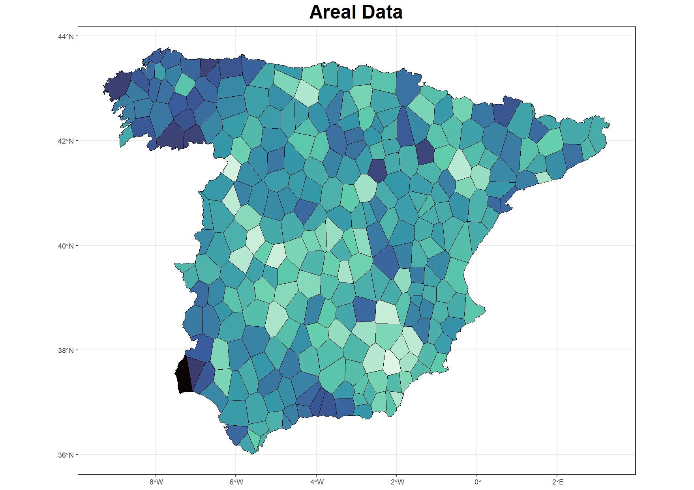{.absolute top="410" left="0" width="450" height="300"}
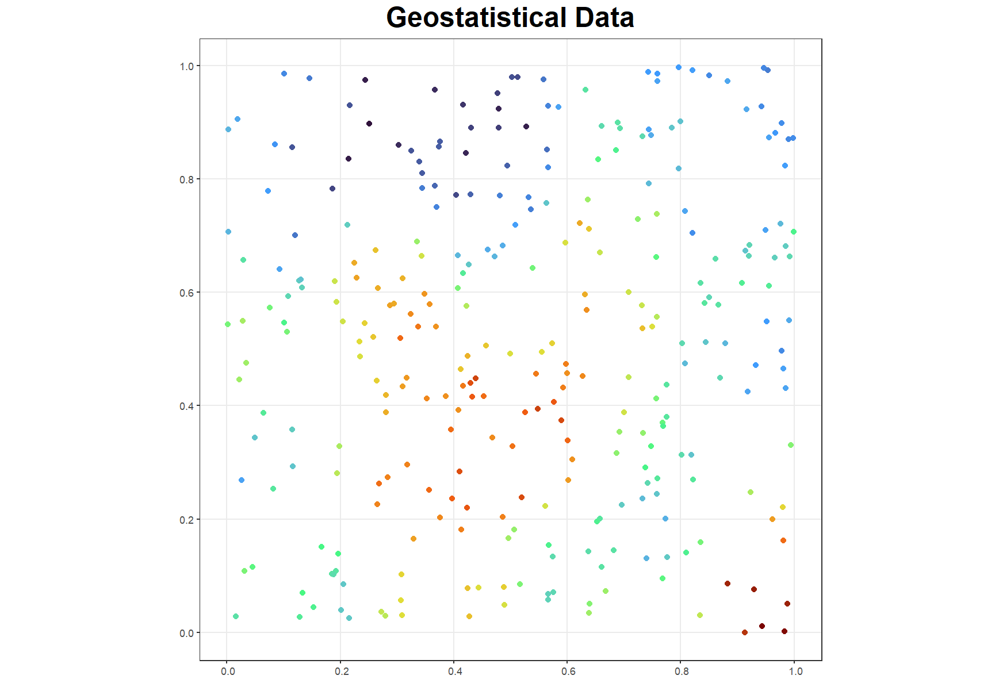{.absolute top="410" left="430" width="450" height="300"}
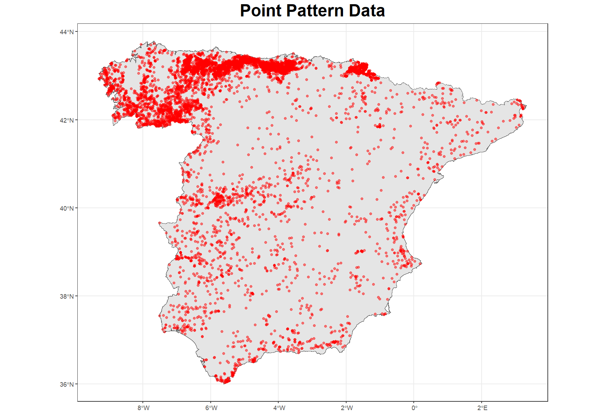{.absolute top="410" left="850" width="450" height="300"}

## Spatio-temporal models{.smaller}

For these three data types (areal, geostatistical, and point pattern data), different modeling approaches exist in which latent components (prior distributions) play a central role, although they may be embedded differently across models. In particular, these models can be characterized as follows:

- **Areal model**:

$$
\mathbf{u} \sim \text{GMRF}(\boldsymbol\mu, \mathbf{Q} = f(\mathbf{D,W,\boldsymbol\theta})), \quad \mathbf{Q}_{st} = \mathbf{Q}_s \otimes \mathbf{Q}_t \; \text{or} \; \mathbf{Q}_{st} = \mathbf{Q}_t \otimes \mathbf{Q}_s.
$$

- **Geostatistical model**: 

$$
\mathbf{Q} = \tau^2 (\kappa^4 \mathbf{C} + 2\kappa^2\mathbf{G} + \mathbf{G}\mathbf{C}^{-1}\mathbf{G}).
$$

- **Point processes**: 

$$
\log \pi(\mathbf{y} \mid \mathbf{x}, \boldsymbol\theta) = |\boldsymbol\Omega|-\int_{\mathbf{s} \in \boldsymbol\Omega} \lambda(s \mid \mathbf{x}, \boldsymbol\theta) + \sum_{i=1}^n \log(\lambda(s_i \mid \mathbf{x}, \boldsymbol\theta)).
$$

## Dealing with high complexity {.smaller}

The term **complexity** is associated with very different meanings, even within the fields of mathematics, computer science, and physics. Here, we adopt a practical or operational interpretation of **computational complexity** in the context of statistical inference. From an operational perspective, the complexity of an inferential process refers to the difficulty of carrying out a task in terms of its computational procedure. This difficulty may arise from different sources and can have fundamentally different impacts on the inferential model.

In particular, we focus on several aspects of computational complexity related to computational cost:

- **Computation time**: the computational cost measured by the time required to fit a model.
- **Operations per processor core**: the workload in terms of the number of operations (*FLOPs*) required per processor core.
- **Memory usage (RAM)**: the amount of memory required to perform the inference.

These aspects of computational complexity in statistical analysis are closely interrelated. For instance, an increase in the number of operations per core typically leads to longer computation times, while lower memory requirements often result in reduced computational time. Likewise, a smaller number of operations per core usually implies lower memory usage.

## Dealing with high complexity {.smaller}

Computational complexity is encoded in a statistical model through its various components and through the inferential procedure itself. Assuming a fixed model and the INLA methodology, at least four key aspects can be identified as having a direct impact on the computational complexity of inference:

- **Number of observations**: the number of observations determines the dimension of the likelihood
$$
\pi(\mathbf{y} \mid \boldsymbol\eta, \boldsymbol\theta) = \prod_{i=1}^n\pi(y_i \mid \eta_i, \boldsymbol\theta).
$$
- **Dimension of the latent field**: the dimension of the latent field prior—and in particular of its posterior—directly affects both the number of required operations and memory usage, and therefore the overall computational cost:
$$
\small
\log\tilde{\pi}(\boldsymbol\theta \mid \mathbf{y}) = \left[\sum_{i=1}^n\log\pi(y_i \mid \mathbf{x}, \boldsymbol\theta) + |\mathbf{Q}(\boldsymbol\theta)| - \frac{1}{2} (\mathbf{x} - \boldsymbol\mu)^\top \mathbf{Q}(\boldsymbol\theta) (\mathbf{x} - \boldsymbol\mu) - |\mathbf{Q}_{x\mid y, \boldsymbol\theta}(\boldsymbol\theta)| + \frac{1}{2} (\mathbf{x} - \boldsymbol\mu_{x\mid y, \boldsymbol\theta})^\top \mathbf{Q}_{x\mid y, \boldsymbol\theta}(\boldsymbol\theta) (\mathbf{x} - \boldsymbol\mu_{x\mid y, \boldsymbol\theta}) \right]_{\mathbf{x} = \mathbf{x}^*}.
$$
- **The geometry (shape) of the posterior distribution**: the (actual) geometry of the posterior distribution influences the optimization procedure used to locate the mode of the conditional posterior of the latent field,
$$
\arg\min_{\mathbf{x}}-\log\pi(\mathbf{x} \mid \boldsymbol\theta, \mathbf{y}) = \arg\min_{\mathbf{x}} \{-\log\pi(\mathbf{y} \mid \mathbf{x}, \boldsymbol\theta) - \log\pi(\mathbf{x} \mid \boldsymbol\theta)\}.
$$
- **The initial point for optimization**: the choice of the initial point for minimizing the negative log joint posterior of the hyperparamters, or equivalently the negative log conditional posterior, affects the number of operations required to reach the posterior mode.

# Updating model information

<ul>
  <li style="color: rgba(0,0,0,0.25); font-style: italic;">Introduction</li>
  <li style="color: red; font-synthesis-weight: auto;"> <strong>Updating model information</strong> </li>
  <ul>
    <li style="color: red; font-synthesis-weight: auto;"> <strong>Bayesian Feedback</strong> </li>
    <li style="color: red; font-synthesis-weight: auto;"> <strong>Sequential Consensus</strong> </li>
  </ul>
  <li style="color: rgba(0,0,0,0.25); font-style: italic;">Distributed and Recursive Inference</li>
  <li style="color: rgba(0,0,0,0.25); font-style: italic;">Implementations</li>
  <li style="color: rgba(0,0,0,0.25); font-style: italic;">Conclusions and future research lines</li>
</ul>

## {.smaller}

The updating of model information refers to a procedure capable of transferring information across models. In Bayesian statistics, Bayes’ theorem provides a natural mechanism for such information transfer:
$$
\pi(\boldsymbol\xi \mid \mathbf{y}) = \frac{\pi(\mathbf{y} \mid \boldsymbol\xi) \pi(\boldsymbol\xi)}{\pi(\mathbf{y})}. 
$$
This expression can, in general, be reformulated as:
$$
\pi(\boldsymbol\xi \mid \mathbf{y}) \propto 
\left\{\begin{array}{l}
\pi(\mathbf{y}_1 \mid \boldsymbol\xi) \cdot \left[ \pi(\mathbf{y}_2 \mid \boldsymbol\xi) \cdot \pi(\boldsymbol\xi)\right] \propto \pi(\mathbf{y}_1 \mid \boldsymbol\xi) \pi(\boldsymbol\xi \mid \mathbf{y}_2) \\
\left[\pi(\mathbf{y}_1 \mid \boldsymbol\xi) \cdot \pi(\boldsymbol\xi)^{1/2} \right] \cdot \left[\pi(\mathbf{y}_2 \mid \boldsymbol\xi) \cdot \pi(\boldsymbol\xi)^{1/2}\right] \propto \pi(\boldsymbol\xi \mid \mathbf{y}_1) \cdot \pi(\boldsymbol\xi \mid \mathbf{y}_2)
\end{array}\right. \quad .
$$

However, this formulation raises several fundamental computational and methodological questions:

- **Marginal likelihood computation**: how can the marginal likelihood $\pi(\mathbf{y}_i)$ be computed efficiently, or avoided altogether, in practice?
- **Closed-form posteriors**: under what conditions is a closed-form expression for the partial posteriors $\pi(\boldsymbol\xi \mid \mathbf{y}_i)$ available, and how should inference proceed when it is not?
- **Sequential ordering**: when closed-form expressions are unavailable, how does the ordering of datasets in a recursive or sequential update affect the resulting posterior?
- **Consistency of inference**: to what extent do different orderings and partitions of the data and the model lead to different inferential outcomes, and how can the resulting variability be controlled or mitigated?

<!-- Estas cuestiones serán evaluadas a lo largo deesta sección y finalmente expuestas de forma completamente organizadas en la siguiente sección relativa a la inferencia distribuida y recursiva. -->

## Bayesian Feedback {.smaller}

*Bayesian Feedback* refers to a procedure for transferring information between models that share the same parameters but are associated with different observations of the same underlying phenomenon, $\mathcal{M}(\mathbf{y}_1,\boldsymbol\xi)$ and $\mathcal{M}(\mathbf{y}_2, \boldsymbol\xi)$. That is, it focuses on updating the model parameters $\boldsymbol\xi$ of $\mathcal{M}$.

The *Bayesian Feedback* procedure is characterized by defining prior distributions from the marginal posterior distributions of the parameters, thereby emphasizing the transfer of marginal information:
$$
\pi(\xi \mid \mathbf{y}_2) \propto \pi(\mathbf{y}_2 \mid \boldsymbol\xi) \prod_{i=1}^{n}\pi(\xi_i \mid \mathbf{y}_1).
$$

However, despite enabling information transfer across models, this approach presents several limitations:

- It requires the marginal posterior distributions associated with nodes of the latent field to be Gaussian in order for the transfer to be effective within `R-INLA`.
- Correlation between parameters is lost when information is transferred solely through marginal distributions. When the latent field contains sets of nodes with dependencies or correlations, marginal-based transfer cannot be used, as the dependence structure is not preserved in the new model.
- It inevitably discards information by transferring only marginal summaries, ignoring joint and higher-order dependence structures.
- It is not order independent.

## Sequential Consensus {.smaller}

To overcome the limitations of *Bayesian Feedback*--particularly those related to the transfer of information from correlated latent field nodes--and to enable a more flexible approach to sequential updating of model parameters, a sequential consensus approach is proposed within the INLA framework. Specifically, two algorithms are introduced: one for general sequential parameter updating, and another tailored to Big Data settings.

The general idea behind both algorithms is that we can perform an update of the fixed effects of the latent field and hyperparamters by the *Bayesian Feedback* procedure and then a consensus of the latent field nodes related to random effects. Therefore, for the fixed and hyperparameters the sequential update along a partitions of the data $\mathbf{y} = \{\mathbf{y}_1, \dots, \mathbf{y}_n\}$ is perform as:
$$
\begin{array}{c}
\pi(x_k \mid \mathbf{y}) \approx C_k \cdot \pi(\mathbf{y}_1 \mid x_k) \prod_{i=2}^n \pi(x_k \mid \mathbf{y}_i), \\
\pi(\theta_m \mid \mathbf{y}) \approx C_m \cdot \pi(\mathbf{y}_1 \mid \theta_m) \prod_{i=2}^n \pi(\theta_m \mid \mathbf{y}_i).
\end{array}
$$

Once the sequential update is perform, it is possible to apply one of the following strategies to perform the consensus for the random effects: (i) marginal weighted averages and (ii) product of multivariate Gaussian densities.
$$
\begin{array}{c}
x_k \approx \sum_{i=1}^n w_i x_{ki} \quad (\text{marginal weighted averages}), \\
\pi(\mathbf{x}_k \mid \mathbf{y}) \approx \prod_{i=1}^n \pi(\mathbf{x}_k \mid \mathbf{y}_i) \quad (\text{product of multivariate Gaussian densities}).
\end{array}
$$

## Sequential Consensus {.smaller}
### Scheme of the algorithms

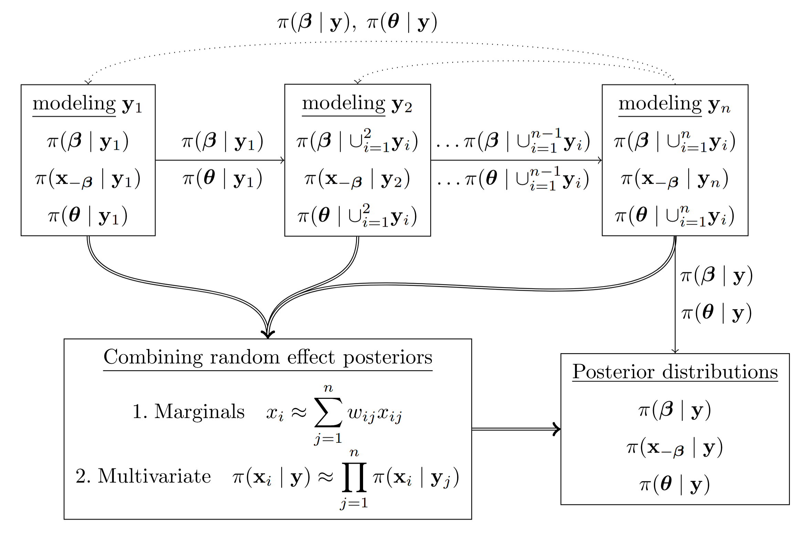{.absolute left="200" width="900" height="600"}

## Sequential Consensus {.smaller}
### Sequential Consensus algorithm

This first algorithm for implementing the proposed sequential consensus approach is aimed at reducing model complexity by partitioning the data into subsets, for example when working with integrated models that can be decomposed according to groups of data associated with different likelihoods. This includes settings in which parameters are shared across components via scaling relationships, such as those implemented using the `copy` feature in INLA.

To this end, the previously described information-transfer procedure is followed:

- **Sequential updating of marginal information**: the marginal posteriors of fixed effects and hyperparameters are updated sequentially across models,
$$
\begin{array}{c}
\pi(x_k \mid \mathbf{y}_{1:i}) \longrightarrow \pi(x_k \mid \mathbf{y}_{1:(i+1)}) \propto \pi(\mathbf{y}_{i+1} \mid x_k) \pi(x_k \mid \mathbf{y}_{1:i}), \\
\pi(\theta_m \mid \mathbf{y}_{1:i}) \longrightarrow \pi(\theta_m \mid \mathbf{y}_{1:(i+1)}) \propto \pi(\mathbf{y}_{i+1} \mid \theta_m) \pi(\theta_m \mid \mathbf{y}_{1:i}).
\end{array}
$$
- **Consensus step**: posterior information is combined using either marginal weighting or the product of multivariate normal posterior densities.
- **Scaling parameters for shared effects**: when scaling parameters are present between shared effects (denoted $\beta_{copy}$), their estimation can be obtained by deriving the distribution of $\alpha_j = x^*_j/x_j$ via a second-order Taylor expansion, and then approximating $\pi(\beta_{copy}) \approx \prod_j\pi(\alpha_j)$.

## Sequential Consensus {.smaller}
### Sequential Consensus for latent field partitions (SCP)

This second algorithm is explicitly designed for Big Data settings and extends the first algorithm by building on its final output. By exploiting the hyperparameter estimates obtained in the initial stage, it performs a second pass over the data to accurately estimate latent field nodes associated with random effects that are not present across all data partitions. The procedure is structured as follows:

- **Initialization from the first algorithm**: start from the final output of the first algorithm, using the estimated hyperparameters as fixed inputs for the second stage.
- **Reuse of the hyperparameter design**: retain the central composite design (CCD) and the corresponding weights from the joint marginal posterior of the hyperparameters obtained in the final step of the first algorithm.
- **Second pass over the data**: iterate over the data partitions to estimate latent field nodes associated with random effects that are absent from some of the partition-specific models.
- **Computation of posterior marginals**: within each partition, compute the posterior marginal distributions of the remaining random-effect nodes while keeping the CCD fixed.
- **Information control**: use the appropriate marginal posterior distributions of the fixed effects to avoid information duplication across partitions, thereby ensuring coherent posterior inference and preserving information on the random effects.

<!-- ## Sequential Consensus {.smaller} -->
<!-- ### Sequential Consensus for latent field partitions (SCP) -->

<!-- The information control implies that, to compute the proper marginal posterior of the random effects of the latent field ($\mathbf{x}_{r}$), we need to use as prior distribution of the fixed effects for every partition the marginal given the complementary data $\pi(\boldsymbol\beta \mid \mathbf{y}_{-i})$. We estimate $\pi(\boldsymbol\beta \mid \mathbf{y}_{-i})$ as: -->
<!-- $$ -->
<!-- \pi(\boldsymbol\beta \mid \mathbf{y}) \propto \left[\prod_{j=1}^i\pi(\mathbf{y}_{j} \mid \boldsymbol\beta)\pi(\boldsymbol\beta)\right] \times  \prod_{k=i+1}^n\pi(\mathbf{y}_{k} \mid \boldsymbol\beta) \Rightarrow \tilde{\pi}(\boldsymbol\beta \mid \mathbf{y}_{-i}) = \frac{\pi(\boldsymbol\beta \mid \mathbf{y}) \pi(\boldsymbol\beta \mid \mathbf{y}_{1:(i-1)})}{\pi(\boldsymbol\beta \mid \mathbf{y}_{1:i})} -->
<!-- $$ -->

<!-- If we assume that $\pi(\boldsymbol\beta \mid \mathbf{y})$, $\pi(\boldsymbol\beta \mid \mathbf{y}_{1:i})$ and $\pi(\boldsymbol\beta \mid \mathbf{y}_{1:(i-1)})$ are Gaussians then $\pi(\boldsymbol\beta \mid \mathbf{y}_{-i})$ is also Gaussian, with mean ($\mu^*$) and precision ($\tau^*$) computed as: -->
<!-- $$ -->
<!-- \begin{array}{c} -->
<!-- \mu^* = \mu_{n} + \mu_{i-1} - \mu_{i}, \\ -->
<!-- \tau^* = (\tau_n + \tau_{i-1} - \tau_{i}) \times (\tau_n \mu_n + \tau_{i-1} \mu_{i-1} - \tau_i\mu_i). -->
<!-- \end{array} -->
<!-- $$ -->

<!-- This approach allows to compute a more adequate posterior of the random effects for the partitions without using duplicate information from the fixed effects.  -->

# Distributed and Recursive Inference

<ul>
  <li style="color: rgba(0,0,0,0.25); font-style: italic;">Introduction</li>
  <li style="color: rgba(0,0,0,0.25); font-style: italic;">Updating model information</li>
  <li style="color: red; font-synthesis-weight: auto;"> <strong>Distributed and Recursive Inference</strong> </li>
  <ul>
    <li style="color: red; font-synthesis-weight: auto;"> <strong>Distributed Inference (DI)</strong> </li>
    <li style="color: red; font-synthesis-weight: auto;"> <strong>Recursive Inference (RI)</strong> </li>
    <li style="color: red; font-synthesis-weight: auto;"> <strong>Partitioning model structures</strong> </li>
  </ul>
  <li style="color: rgba(0,0,0,0.25); font-style: italic;">Implementations</li>
  <li style="color: rgba(0,0,0,0.25); font-style: italic;">Conclusions and future research lines</li>
</ul>

## {.smaller}

In this section, we present the proposed distributed and recursive inference approaches, which address many of the main limitations of *Bayesian Feedback* and *Sequential Consensus* algorithms. In particular, the strategies developed for both approaches are based on decomposing the inferential process into two main pieces: (i) obtaining an approximation to the joint marginal posterior distribution of the hyperparameters, together with an appropriate integration scheme, and (ii) estimating the posterior distribution of the latent field.

Specifically, the focus is on approximating the **joint marginal posterior of the hyperparameters**,
$$
\tilde{\pi}(\boldsymbol\theta \mid \mathbf{y}) \propto \left[\frac{\pi(\mathbf{y} \mid \mathbf{x}, \boldsymbol\theta) \pi(\mathbf{x} \mid \boldsymbol\theta) \pi(\boldsymbol\theta)}{\tilde{\pi}_G(\mathbf{x} \mid \boldsymbol\theta, \mathbf{y})}\right],
$$
from which an integration scheme is constructed to obtain the **marginal posterior distributions for each node of the latent field**,
$$
\tilde{\pi}(x_i \mid \mathbf{y}) = \sum_{k=1}^K \tilde{\pi}(x_i \mid \boldsymbol\theta^k, \mathbf{y}) \tilde{\pi}(\boldsymbol\theta^k \mid \mathbf{y})\Delta_k.
$$

To achieve this, it is necessary to define how to compute the **conditional posterior of the latent field** $\tilde{\pi}_G(\mathbf{x} \mid \boldsymbol\theta, \mathbf{y})$, in a distributed and recursive setting, as well as how to obtain its marginal distributions $\tilde{\pi}(x_i \mid \boldsymbol\theta, \mathbf{y})$. 

Once these components are available, a range of strategies can be employed to compute the **marginal posterior distributions of the hyperparameters** ($\pi(\boldsymbol\theta_j \mid \mathbf{y})$) and to derive appropriate **goodness-of-fit measures**.

## Distributed Inference

Following the same structure used to present the methodological details of INLA, we adopt this framework to describe the proposed approach for **distributed inference** based on **INLA**. In both frameworks, the aim is to perform inference in settings where the dataset is either naturally partitioned or deliberately split into multiple subsets $\mathbf{y} = \{\mathbf{y}_1, \dots, \mathbf{y}_n\}$. Accordingly, we examine the method in terms of the computation of:

- the conditional posterior of the latent field,
- the joint marginal posterior of the hyperparameters,
- the marginal posterior of the latent field, and
- the marginal posterior of the hyperparameters.

## {.smaller}
### Conditional posterior of the latent field 

To compute the conditional posterior of the latent field when the data have been partitioned, we can derive it from the general expression:
$$
\pi(\mathbf{x} \mid \boldsymbol\theta, \mathbf{y}) \propto \prod_{i=1}^n \left[ \pi(\mathbf{y}_i \mid \mathbf{x}, \boldsymbol\theta) \pi(\mathbf{x} \mid \boldsymbol\theta)^{w_i}\right] \propto \left(\prod_{i=1}^n \left[ \pi(\mathbf{y}_i \mid \mathbf{x}, \boldsymbol\theta) \pi(\mathbf{x} \mid \boldsymbol\theta)\right]\right)/\pi(\mathbf{x} \mid \boldsymbol\theta)^{n-1},
$$
where $\sum_{i=1}^n w_i = 1$ and $w_i>0$. This formula allow us to proposed two strategies to compute the conditional posterior: (i) scaling the prior distribution and (ii) the scaling the posterior.

In general, the expression to compute the conditional posterior distribution in a distributed framework is:
$$
\tilde{\pi}_d(\mathbf{x} \mid \boldsymbol\theta, \mathbf{y}) \propto \prod_{i=1}^n \tilde{\pi}_G(\mathbf{x} \mid \boldsymbol\theta, \mathbf{y}_i),
$$
where $\pi(\mathbf{x} \mid \boldsymbol\theta, \mathbf{y}_i)$ is the Gaussian approximation for the conditional posterior of the latent field for the i-th partition. Therefore, the conditional posterior under the distributed framework is also a Gaussian distribution with mean ($\boldsymbol\mu_d(\boldsymbol\theta)$) and precision matrix ($\mathbf{Q}_d(\boldsymbol\theta)$) defined as:
$$
\begin{array}{c}
\mathbf{Q}_d(\boldsymbol\theta) = \sum_{i=1}^n \mathbf{Q}_i(\boldsymbol\theta) = \sum_{i=1}^n \left[ w_i\mathbf{Q}(\boldsymbol\theta) - \mathbf{A}_i^\top \nabla_{\boldsymbol\eta_i}^2\pi(\mathbf{y}_i \mid \boldsymbol\eta_i, \boldsymbol\theta) \mathbf{A}_i  \right]_{\mathbf{\mathbf{x}=\mathbf{x}_i^*}}, \\
\boldsymbol\mu_d(\boldsymbol\theta) = \mathbf{Q}_d(\boldsymbol\theta)^{-1} \times \sum_{i=1}^n\mathbf{Q}_i(\boldsymbol\theta)\boldsymbol\mu_i(\boldsymbol\theta), \quad \boldsymbol\mu_i(\boldsymbol\theta) = \mathbf{x}_i^* = -\arg\min_{\mathbf{x}}\left\{ - \log\pi(\mathbf{y}_i \mid \mathbf{x}, \boldsymbol\theta) - w_i\log\pi(\mathbf{x} \mid \boldsymbol\theta) \right\}.
\end{array}
$$

## {.smaller}
### Joint marginal posterior of the hyperparameters

The joint marginal posterior of the hyperparameters, when the dataset is partitioned, can be computed as the product of the joint marginal posteriors of the hyperparameters obtained via the INLA method for each of the partitions. That is:
$$
\tilde{\pi}_{d}(\boldsymbol\theta \mid \mathbf{y}) \propto \prod_{i=1}^n \left[\frac{\pi(\mathbf{y}_i \mid \mathbf{x}, \boldsymbol\theta)\pi(\mathbf{x} \mid \boldsymbol\theta)\pi(\boldsymbol\theta)}{\tilde{\pi}_G(\mathbf{x} \mid \boldsymbol\theta, \mathbf{y}_i)}\right]_{\mathbf{x}=\mathbf{x}_i^*} = \prod_{i=1}^n \tilde{\pi}(\boldsymbol\theta \mid \mathbf{y}_i). 
$$
One of the main problems is on computing the distributed proposed joint marginal to lately defined the CCD scheme, or other scheme, for computing the marginals of the latent field, along with the marginal likelihood and other measures. In this sense, the proposal is to leverage the Gaussian approximation that is possible to compute for each partition and defined the joint maginal posterior as:
$$
\tilde{\pi}_{dG}(\boldsymbol\theta \mid \mathbf{y}) \propto \prod_{i=1}^n \tilde{\pi}_G(\boldsymbol\theta \mid \mathbf{y}_i).
$$
From this estimation we have an approximate posterior density for the hyperparameters (in their internal parametrization) that allow us to build a integration scheme, like the CCD. Therefore, once we have the integration scheme leveraging the Gaussian approximation we can use the former formula to compute the joint marginal posterior of the hyperparameters in the support points (integration points) for the marginal posterior of the laten field nodes. 

## {.smaller}
### Marginal posterior of the latent field

In the computation of the marginal posterior for each node of the latent field we leverage the formula used in the INLA method:
$$
\tilde{\pi}(x_i \mid \mathbf{y}) = \sum_{k=1}^K \tilde{\pi}(x_i \mid \boldsymbol\theta^k, \mathbf{y}) \tilde{\pi}(\boldsymbol\theta^k \mid \mathbf{y}) \Delta_k,
$$
where we apply a numerical integration approach using the integration scheme fixing a set of support points $\{\boldsymbol\theta^k\}_{k=1}^K$, $\tilde{\pi}(x_i \mid \boldsymbol\theta^k, \mathbf{y})$ and $\tilde{\pi}(\boldsymbol\theta^k \mid \mathbf{y})$ are the marginal of the conditional of the latent field and the joint marginal of the hyperparatmers at the support points, and $\Delta_k$ are the weights for each support point.

This expression can be easily rewritten, in a strightforward manner, for the distributed approach as:
$$
\tilde{\pi}_d(x_i \mid \mathbf{y}) = \sum_{k=1}^K \tilde{\pi}_d(x_i \mid \boldsymbol\theta^k, \mathbf{y}) \tilde{\pi}_d(\boldsymbol\theta^k \mid \mathbf{y}) \Delta_k,
$$
where the $\Delta_k$ quantity is compute, and generally can be computed, in the same way as in the standard INLA approach, $\tilde{\pi}_d(\boldsymbol\theta^k \mid \mathbf{y})$ is the marginal computed in the distributed proposal previously explained and $\tilde{\pi}_d(x_i \mid \boldsymbol\theta^k, \mathbf{y})$ is the marginal of the conditional posterior of the latent field for each node. This later quantity is the only that we need to compute now to perform the calculus of the marginal for each node. 

<!-- ## {.smaller} -->

<!-- To compute the marginal distributions of the conditional posterior, the same four strategies available in the standard INLA methodology can be employed: -->

<!-- - marginalizing the Gaussian approximation of the conditional posterior evaluated at the mode, -->
<!-- - applying a Laplace approximation independently for each node, -->
<!-- - using a simplified Laplace approximation (based on a third-order Taylor expansion), or -->
<!-- - using the Gaussian approximation with a Variational Bayes (VB) correction to the mean. -->

<!-- However, in the distributed setting, additional difficulties may arise. When the full dataset is not available jointly and inference can only be performed through data partitions, the standard approaches for obtaining $\tilde{\pi}(x_i \mid \boldsymbol\theta, \mathbf{y})$ cannot be directly applied. Instead, one typically obtains partition-specific conditional marginals of the form $\tilde{\pi}(x_i \mid \boldsymbol\theta, \mathbf{y}_i)$ -->

<!-- The easiest alternative strategy is therefore to compute the conditional posterior of the latent field separately for each data partition, incorporating a VB mean correction in each case, and then to combine these results to obtain a distributed conditional posterior. From this distributed conditional posterior, the marginal distributions under the Gaussian approximation can be computed, as it naturally aggregates the VB corrections contributed by all partitions. -->

<!-- - Compute the marginal of the conditonal posterior of the latent field from the distributed conditional posterior of the latent field that integrates the mean VB correction from each partition. -->

## {.smaller}

### Marginal posterior hyperparameters

The marginal posterior of the hyperparameters can be computed following the same strategies as in the based INLA method:

  - Marginalized a Gaussian approximation around the mode of the joint marginal posterior.
  - Numerical integration using a exploration grid and interpolation: (i) direct interpolation, or (ii) interpolation using an asymmetric Gaussian apprximation.
  - Numerical integration-free algorithm (default in `R-INLA`).

In this setting, the distributed expression for the joint marginal posterior of the hyperparameters must be used as the basis for deriving the marginal posterior of each hyperparameter:
$$
\tilde{\pi}_d(\boldsymbol\theta \mid \mathbf{y}) \propto \prod_{i=1}^n \tilde{\pi}(\boldsymbol\theta \mid \mathbf{y}_i).
$$

However, within a distributed framework, accurately computing marginal posterior distributions based on this expression is computationally demanding. This difficulty arises both from the numerical integration strategies required and from the additional computational burden imposed by distributed implementations of integration-free algorithms. Consequently, the simplest and most computationally efficient approach is to compute the marginal posteriors using the Gaussian approximation, $\pi_{dG}(\boldsymbol\theta \mid \mathbf{y})$.  

## Recursive Inference 

Following the structure used to present the methodological details of INLA, we describe the proposed recursive inference approach based on INLA, building on the distributed framework introduced above. The discussion therefore focuses on: 

- the **computation of the conditional posterior of the latent field** and 
- the **marginal posterior of the latent field**. 

The joint marginal and marginal posterior distributions of the hyperparameters are omitted, as they are obtained using the same strategies as in the distributed setting. Notably, any distributed framework can be applied recursively, allowing the distributed inference approach to be used directly for recursive inference.

## {.smaller}
### Conditional posterior latent field

To compute the conditional posterior of the latent field in a recursive setting, we exploit the fact that, once the set of support points is fixed, the computation can be carried out sequentially as
$$
\tilde{\pi}_r(\mathbf{x} \mid \boldsymbol\theta^k, \mathbf{y}_{1:i}) = \tilde{\pi}_G(\mathbf{x} \mid \boldsymbol\theta^k, \mathbf{y}_{1:i}).
$$
That is, at the $i$-th step, the Gaussian approximation to the conditional posterior is defined recursively. Consequently, the posterior distribution $\tilde{\pi}_r(\mathbf{x} \mid \boldsymbol\theta^k, \mathbf{y}_{1:i})$ is fully characterized by a mean vector $\mathbf{x}_{ir}(\boldsymbol\theta^k)$ and a precision matrix $\mathbf{Q}_{ir}(\boldsymbol\theta^k)$, given by
$$
\begin{array}{c}
\boldsymbol\mu_{ir}(\boldsymbol\theta^k) = \mathbf{x}^*_{ir} = -\arg\min_{\mathbf{x}}\{-\log\pi(\mathbf{y}_{i} \mid \mathbf{x}, \boldsymbol\theta^k) -\log\tilde{\pi}_{r}(\mathbf{x} \mid \boldsymbol\theta^k, \mathbf{y}_{1:(i-1)}) \} , \\
\mathbf{Q}_{ir}(\boldsymbol\theta^k) = \mathbf{Q}_{(i-1)r}(\boldsymbol\theta^k) - \left[\mathbf{A}^\top_i \nabla^2_{\boldsymbol\eta_i}\log\pi(\mathbf{y}_{i} \mid \boldsymbol\eta, \boldsymbol\theta^k) \mathbf{A}_i \right]_{\mathbf{x}=\mathbf{x}^*_{ir}}.
\end{array}
$$

Naturally, at the first step of the recursive algorithm, the prior distribution coincides with the standard prior used for the model, $\pi(\mathbf{x} \mid \boldsymbol\theta)$.

Under this procedure, it becomes evident that the proposed approach is, in general, not independent of the ordering adopted for the recursive inference.

## {.smaller}
### Marginal posterior of the latent field

The marginal posterior of the latent field is computed by directly applying one of the four standard INLA strategies:

- marginalizing the Gaussian approximation of the conditional posterior evaluated at the mode,
- applying a Laplace approximation independently for each node,
- using a simplified Laplace approximation based on a third-order Taylor expansion, or
- using the Gaussian approximation with a Variational Bayes (VB) correction to the mean.

Accordingly, the marginal posterior distributions within the recursive framework are obtained as
$$
\tilde{\pi}_r(x_i \mid \mathbf{y}_{1:i}) = \sum_{k=1}^K \tilde{\pi}_r(x_i \mid \boldsymbol\theta^k, \mathbf{y}_{1:i})\tilde{\pi}_r(\boldsymbol\theta^k \mid \mathbf{y}_{1:i})\Delta_k.
$$

A key feature of the recursive framework is that the marginal of the conditional posterior of the latent field $\tilde{\pi}(x_i \mid \boldsymbol\theta^k, \mathbf{y}_{1:i})$ can be computed using the standard INLA methodology without modification. The only difference from the base INLA approach is that, at each recursive step and for each support point $\boldsymbol\theta^k$, the prior distribution of the latent field is given by $\tilde{\pi}_G(\mathbf{x} \mid \boldsymbol\theta^k,  \mathbf{y}_{1:(i-1)})$.

## Partitioning model structures {.smaller}

<!-- So far, the distributed and recursive approaches have been discussed in terms of partitioning the datasets. However, these same approaches can also be formulated by considering a partition of the latent field itself. -->

In this case, the key condition imposed on the partitioning of the latent field—either in the distributed framework or along the sequence in the recursive framework—is that the resulting **prior distributions must be recoverable**. To achieve this, two strategies can be proposed, both **based on partitioning the precision matrix** of the prior distribution: (i) partitioning the latent field into diagonal blocks, which entails a loss of correlation information between blocks, or (ii) extending the diagonal blocks by scaling those elements that appear in multiple partitions.

Formally,
$$
\pi(\mathbf{x} \mid \boldsymbol\theta) = \prod_{i=1}^n\pi(\mathbf{x}_i \mid \boldsymbol\theta),
$$
where $\pi(\mathbf{x}_i \mid \boldsymbol\theta)=\text{MVN}(\boldsymbol\mu_i, \mathbf{Q}_i(\boldsymbol\theta))$. Consequently, we obtain
$$
\begin{array}{c}
\mathbf{Q}_p(\boldsymbol\theta) = \sum_{i=1}^n\mathbf{Q}_i(\boldsymbol\theta), \\
\boldsymbol\mu_p = \mathbf{Q}_p(\boldsymbol\theta)^{-1} \sum_{i=1}^n \mathbf{Q}_i(\boldsymbol\theta) \boldsymbol\mu_i.
\end{array}
$$

**This formulation** enables the construction of a distributed and recursive framework in which the **computational burden** associated with evaluating the posterior densities of the latent field **can be substantially reduced**, particularly for **spatial**, **temporal**, and especially **spatio-temporal models**.

---

## {.smaller}
### Partitioning algorithms

The fundamental basis for defining partitioning algorithms lies in the precision matrices associated with the selected components of the latent field to be partitioned—whether spatial, temporal, spatio-temporal, or otherwise. To this end, four algorithms are proposed for carrying out such partitions:

:::{.fragment .highlight-current-red fragment-index="1"}
:::{.fragment .semi-fade-out fragment-index="2"}
- **Partitioning by separators** (nested dissection),
:::
:::

:::{.fragment .fade-in-then-out fragment-index="1"}
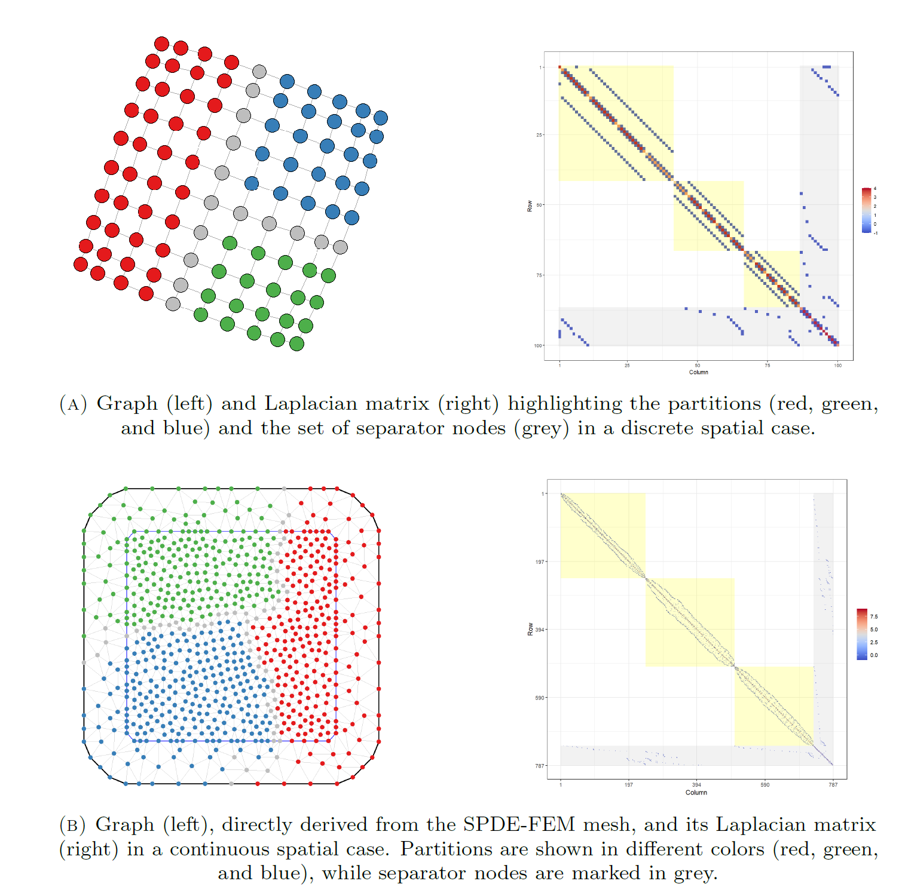{.absolute top="170" left="600" width="550"}
:::

:::{.fragment .highlight-current-red fragment-index="2"}
:::{.fragment .semi-fade-out fragment-index="3"}
- **Block-diagonal partitioning** (bandwidth reduction),
:::
:::

:::{.fragment .fade-in-then-out fragment-index="2"}
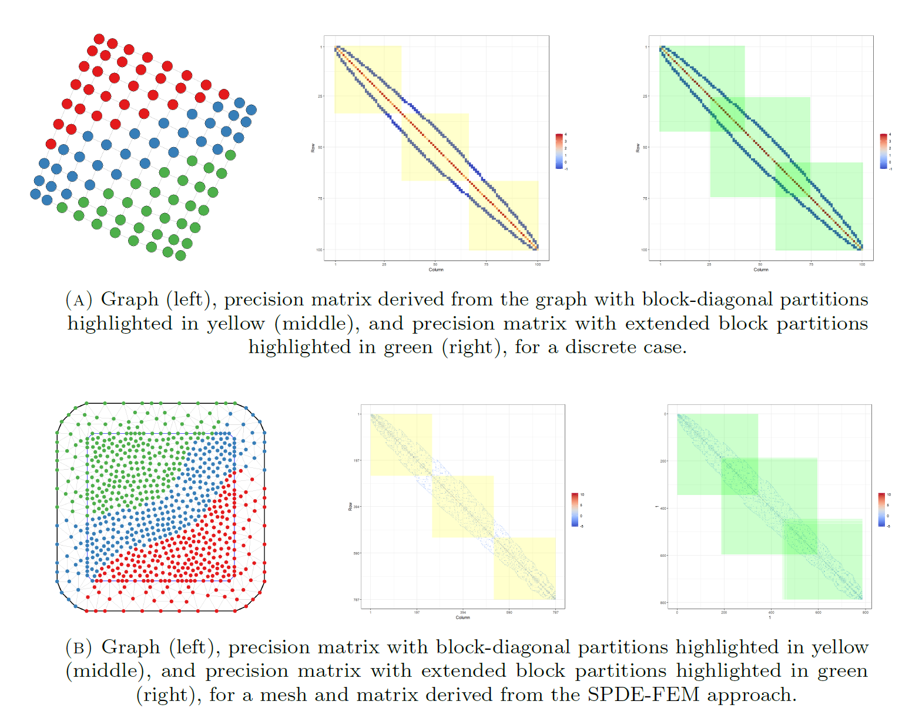{.absolute top="180" left="580" width="700"}
:::

:::{.fragment .highlight-current-red fragment-index="3"}
:::{.fragment .semi-fade-out fragment-index="4"}
- **Spectral clustering for graph partitioning**, and
:::
:::

:::{.fragment .fade-in-then-out fragment-index="3"}
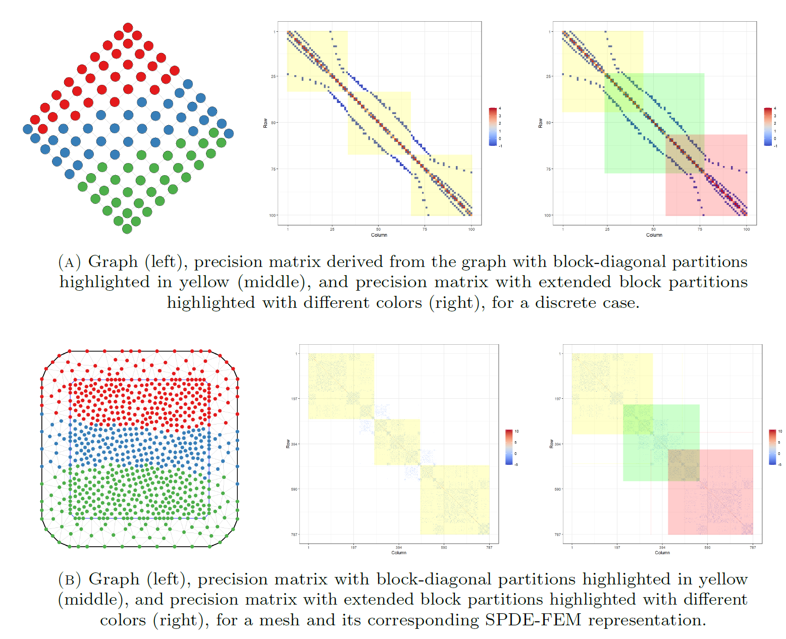{.absolute top="180" left="580" width="700"}
:::

:::{.fragment .highlight-current-red fragment-index="4"}
- **Block partitioning via Voronoi tessellation**.
:::

:::{.fragment .fade-in fragment-index="4"}
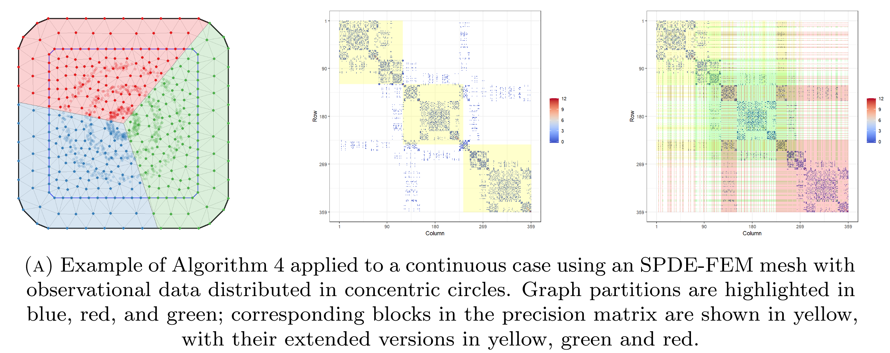{.absolute top="180" left="580" width="700"}
:::

# Implementations

<ul>
  <li style="color: rgba(0,0,0,0.25); font-style: italic;">Introduction</li>
  <li style="color: rgba(0,0,0,0.25); font-style: italic;">Updating model information</li>
  <li style="color: rgba(0,0,0,0.25); font-style: italic;">Distributed and Recursive Inference</li>
  <li style="color: red; font-synthesis-weight: auto;"> <strong>Implementations</strong> </li>
  <ul>
    <li style="color: red; font-synthesis-weight: auto;"> <strong>BAYSPINS</strong> </li>
    <li style="color: red; font-synthesis-weight: auto;"> <strong>Challenges in Spatio-Temporal Modeling of CoDa</strong> </li>
    <ul>
      <li style="color: red; font-synthesis-weight: auto;"> <strong>Expert knowledge</strong> </li>
      <li style="color: red; font-synthesis-weight: auto;"> <strong>Compositional Data</strong> </li>
    </ul>
  </ul>
  <li style="color: rgba(0,0,0,0.25); font-style: italic;">Conclusions and future research lines</li>
</ul>

## BAYSPINS {.smaller}

**BAYSPINS** is a **Shiny application** that enables users to fit **spatial models** through a **user-friendly interface**. It implements the **SPDE–FEM approach** for spatial analysis and integrates several features that make it a flexible and powerful tool, including the ability to:

- specify **flexible random-effect structures** for covariates (e.g., 1D SPDE, AR(1), RW(1), RW(2)), with automatic selection of the number of nodes and optional user control;
- **automatically construct spatial meshes**, as well as define **custom non-convex hull meshes** through dedicated tools;
- perform **geostatistical analysis** and **Log-Gaussian Cox Processes** (LGCPs);
- implement a **Bayesian Feedback** procedure by redefining prior distributions for the **hyperparameters** and for the **univariate Gaussian priors of fixed effects**.

In summary, **BAYSPINS** provides an **automatic**, **code-free environment** for fitting **geostatistical models and LGCPs**. It supports flexible random effects for covariates and enables the incorporation of prior information through a Bayesian Feedback mechanism, making advanced spatial modeling accessible to a broad range of users. 

The application also includes dedicated sections and expandable panels with technical documentation, brief explanations of its core functionalities, and practical guidance on how to use the tool.

---

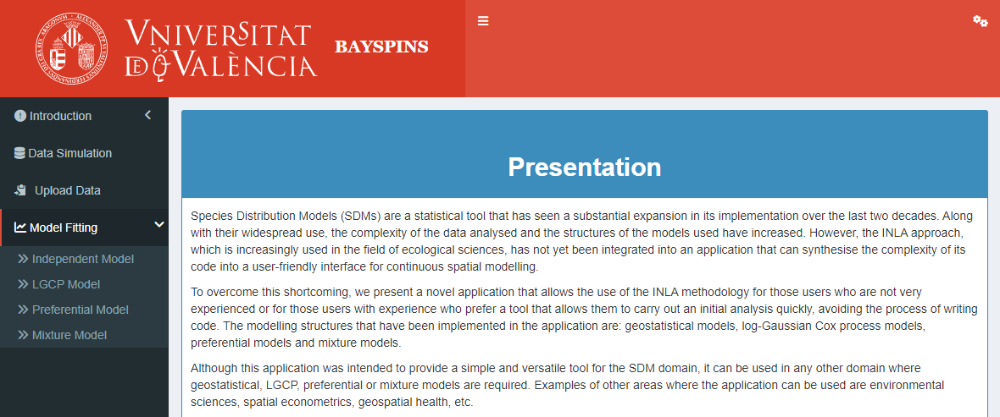

---

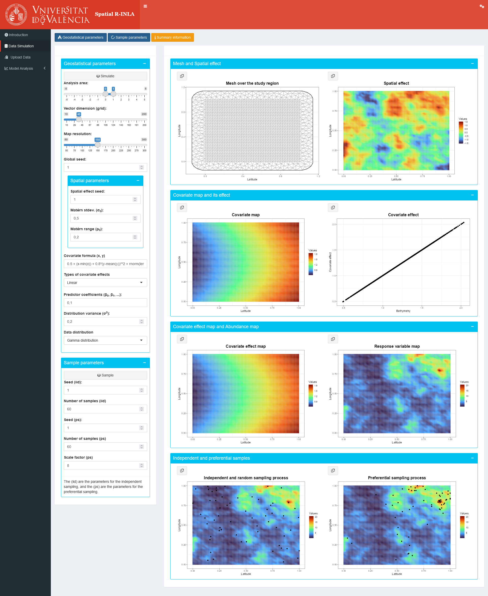{.absolute left="0" width="550"}
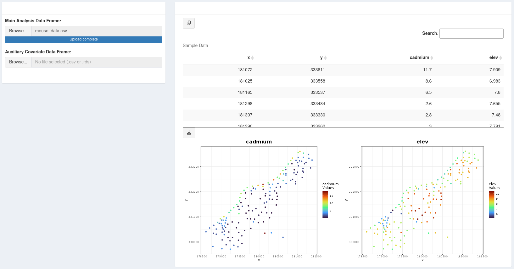{.absolute top="200" left="600" width="650"}

---

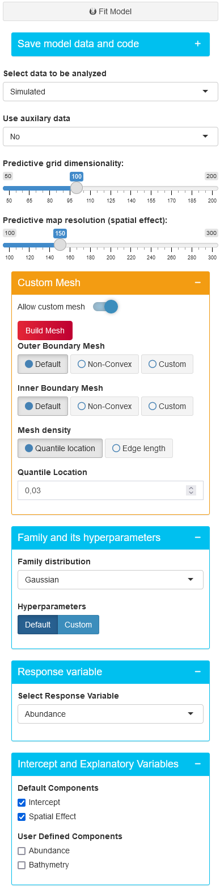{.absolute left="0" width="170"}
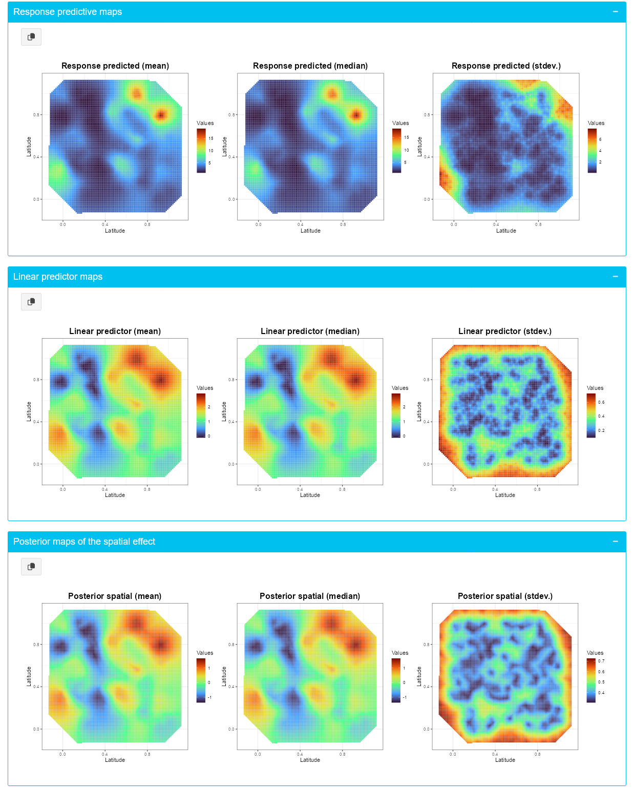{.absolute left="220" width="550"}
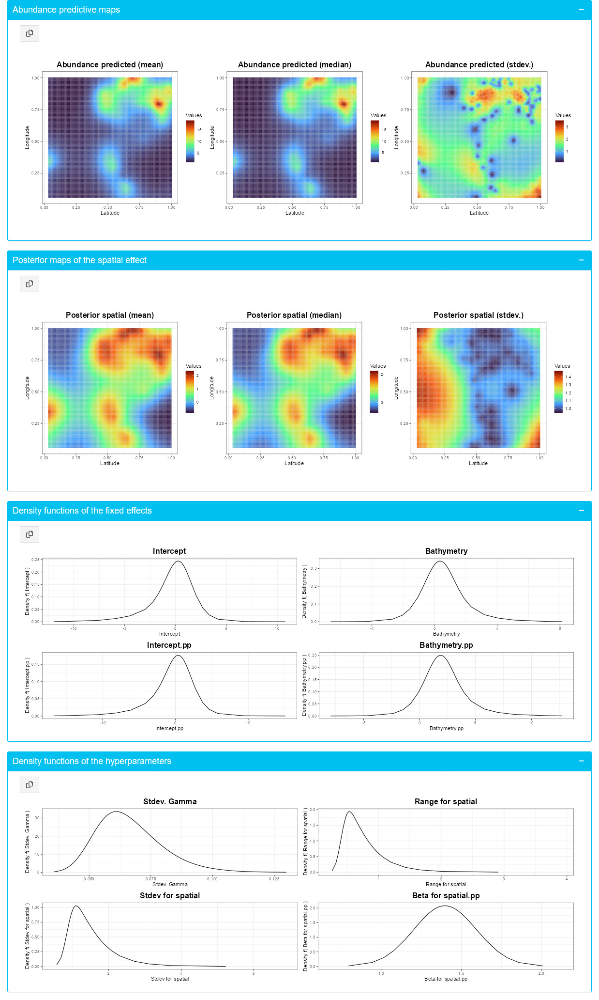{.absolute left="800" width="420"}

## Challenges in Spatio-Temporal Modeling of CoDa {.smaller}

::: {.fragment .fade-in-then-out}
Compositional data variable $\mathbf{Y}=\{\mathbf{y}_{J\times n}\}$ is defined as a vector that satisfies $\sum_{j=1}^J\mathbf{y}_{jn}=1:j\in\{1,..,J\}\quad \& \quad n\in\{1,...,N\}$, and $y_{jn}\in(0,1)$. In a matrix formulation we can express it as
\vspace{1em}
$$
\begin{array}{c}
    \mathbf{Y}=
\left(
\begin{array}{ccc}
    y_{11} & ... & y_{J1} \\
    \vdots & \ddots & \vdots \\
    y_{1N} & ... & y_{JN} \\
\end{array}\right),\\ \\
\displaystyle \sum_{j=1}^{J}Y_{jn}=1,
\end{array}
$$

where $Y_{jn}\in (0,1)$. If we define each row as $Y_{jn}=(Y_{1n}|{Y_{-1,n}})$, then it becomes a simple proportion problem (Beta regression). 
:::

::: {.fragment}
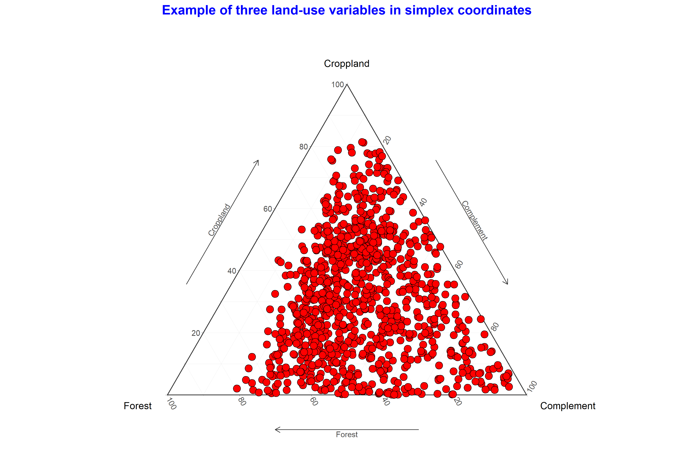{.absolute top="200" right="250" width="800" height="500"}
:::

## {.smaller}

There are two different approaches to analyse CoDa:

- use a Dirichlet distribution for the observational model (likelihood), and
- convert the original vector observations by the log-ratio transformatios (pairwise log-ratios, additive log-ratios, central log-ratios, ...).
  - **Additive log-ratios**:
  $$
  \text{ALR}(y_i \mid y_r) = \log\left(\frac{y_i}{y_r}\right).
  $$
  - **central log-ratios**:
  $$
  \text{CLR}(y_i) = \left(\frac{y_i}{g(\mathbf{y})}\right).
  $$
  
The main challenges addressed in this thesis related to spatio-temporal modelling in CoDa are:

- dealing with 0's,
- downscaling models, and
- Big Data.

## {.smaller}
### Dealing with 0's in CoDa

To handle zeros in compositional data (CoDa), the proposed approach is based on the **centered log-ratio** (CLR) transformation, as it avoids the need to define a reference category, unlike the **additive log-ratio** (ALR) transformation.

Within this framework, we define a **joint model** based on **Hurdle models** to accommodate categories that take zero values. This allows CoDa analysis to be applied to the complementary (non-zero) subset of the data, while a **Bernoulli distribution** is used to model the occurrence of zeros in the affected categories.

$$
\begin{array}{c}
\mathbf{i}_1 \sim \text{Ber}(\boldsymbol\pi_1), \\
\mathbf{y}_1 \mid \mathbf{i}_1=1  \sim \text{MVN}(\boldsymbol\mu_1), \\
\vdots \\
\mathbf{i}_D \sim \text{Ber}(\boldsymbol\pi_D), \\
\mathbf{y}_D \mid \mathbf{i}_D=1 \sim \text{MVN}(\boldsymbol\mu_D). \\
\end{array}
$$

--- 

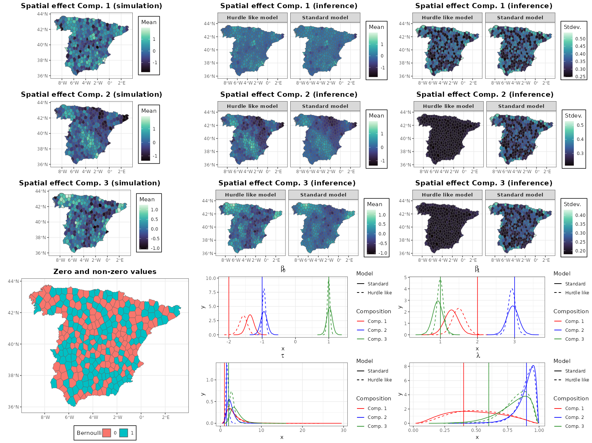{.absolute left="200" width="900"}

## {.smaller}
### Downscaling models in CoDa

<!-- The implementation of **downscaling models for compositional data** (CoDa) was applied to land-use data from the European **LAMASUS** project. The main objective of applying these models to area-level land-use data is to enable an analysis in which **spatial correlations are defined on a continuous domain**, thereby providing spatial information at a continuous scale. This approach also mitigates issues related to **changes in area structure (network spatial structure)**, such as those arising from **modifications of NUTS over time**. -->

<!-- These downscaling models are characterized by the use of a **continuous Gaussian random field** defined over the spatial domain, which is subsequently **integrated over each area** to obtain the area-level estimates associated with each vector of observations. In this study, a model based on the additive **log-ratio (ALR)** transformation is used to analyze **five land-use categories**, and is specified as follows: -->

**Downscaling models for CoDa** were applied to **land-use data** from the **European LAMASUS project**. The primary goal is to enable inference in which **spatial dependence is defined on a continuous domain**, providing spatial information at a finer, continuous scale while **mitigating issues caused by changes in areal units**, such as those induced by evolving **NUTS structure over time**.

These models rely on a **continuous Gaussian random field** defined over the spatial domain and **integrated over each area** to produce area-level estimates for the observed compositions. In this work, land use is modeled through an **additive log-ratio (ALR)** transformation for **five land-use categories**, leading to the following model specification:
$$
\small
\begin{array}{c}
\mathbf{Y} \sim \text{MVN}(\boldsymbol\mu, \tau_e), \quad \mathbf{Y} = (\mathbf{y}_1 \mid \dots \mid \mathbf{y}_4), \;\boldsymbol\mu = (\boldsymbol\mu_1 \mid \dots \mid \boldsymbol\mu_1), \\
\boldsymbol\mu_1 = \beta_{01}\mathbf{1} + \mathbf{X}_i\boldsymbol\beta_1 + \mathbf{u}_{1s}(\mathbf{s}) + \mathbf{u}_{1t}(t) + \mathbf{u}, \\ 
\boldsymbol\mu_2 = \beta_{02}\mathbf{1} + \mathbf{X}_i\boldsymbol\beta_2 + \mathbf{u}_{2s}(\mathbf{s}) + \mathbf{u}_{2t}(t) + \mathbf{u}, \\
\boldsymbol\mu_3 = \beta_{03}\mathbf{1} + \mathbf{X}_i\boldsymbol\beta_3 + \mathbf{u}_{3s}(\mathbf{s}) + \mathbf{u}_{3t}(t) + \mathbf{u}, \\
\boldsymbol\mu_4 = \beta_{04}\mathbf{1} + \mathbf{X}_i\boldsymbol\beta_4 + \mathbf{u}_{4s}(\mathbf{s}) + \mathbf{u}_{4t}(t) + \mathbf{u}. \\
\end{array}
$$
In this formulation, the spatial component $\mathbf{u}_{js}$ for the $j$-th log-ratio component is defined through a downscaling procedure, whereby a continuous Gaussian field, represented using the SPDE–FEM approach, is integrated over each $i$-th area:
$$
u_{ji} = \frac{\int_{\mathbf{s} \in C_i}u_j(\mathbf{s})d\mathbf{s}}{|C_i|}.
$$

---

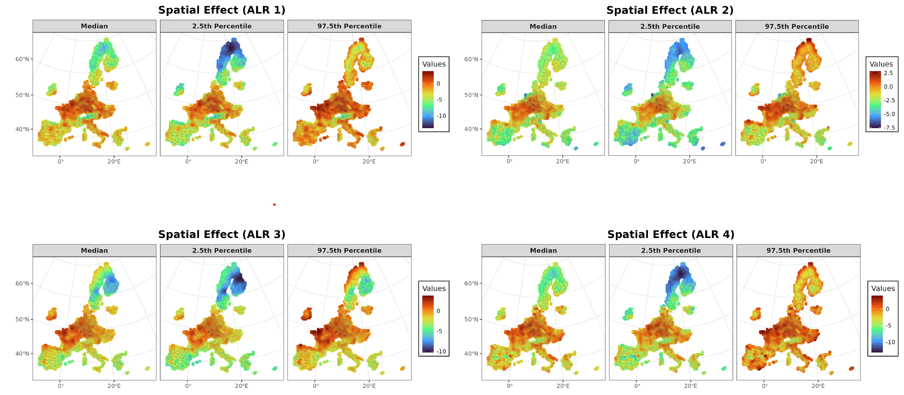{.absolute left="0" width="1400"}

## Sequential update with change of support {.smaller}

This section presents the use of the proposed **Sequential Consensus** procedure to address **change of support** problems arising from multiple sources of information, with particular on the **integration of expert knowledge** and on **spatio-temporal models** that fall within **Big Data settings**, where the spatial structure of areas changes over time.

Changes of support across different information sources can be handled using approaches closely related to those previously introduced for **downscaling models in compositional data** (CoDa). Within this framework, four main types of change of support are considered:

- **spatial change of support**,
- **temporal change of support**,
- **spatio-temporal change of support**, and
- **categorical change of support**.

## {.smaller}

- **Spatial change of support**:

$$
\iint_{s\in C_j} \frac{\eta_{j,a}(s)}{|C_j|}ds
$$

- **Temporal change of support**:

$$
\int_{s\in T_j} \frac{\eta_{j,a}(s)}{|T_j|}ds
$$

- **Spatio-temporal change of support**:

$$
\iiint_{s\in V_j} \frac{\eta_{j,a}(s)}{|V_j|}ds
$$

- **Categorical change of support**:

$$
u^*_k = \sum_{u_i \in g_k} w_{ik} u_i,
$$
where $\sum_{i=1}^K w_{ik}=1$.

## {.smaller}
### Expert knowledge

This example considers a setting where **limited observational data** are **combined with external information**, such as **expert information** reflecting beliefs **about a species' spatial distribution**. The model also accounts for **spatial change of support between expert and observational data**, as well as correlations among experts.

$$
\begin{array}{rcl}
y_{i,obs} & \sim & \mathcal{N}(\mu_i,\tau),\\
\mu_i & = & \beta_0 + u_s(s_i),\\
\mathbf{y}_{j,ex} & \sim & \mathcal{MVN}(\boldsymbol\mu_j, \boldsymbol\Sigma), \\
\boldsymbol\mu_j & = & \boldsymbol\beta_{0,ex} + \int_{C_j}\frac{\beta_0 + u_s(s)}{|C_j|}\text{d}s.
\end{array}
$$

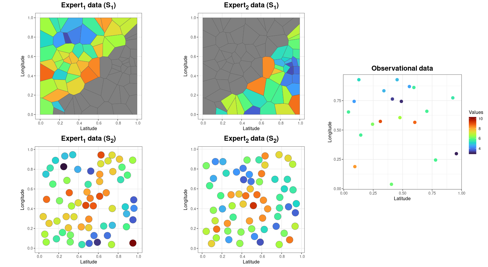{.absolute width="620"}

:::
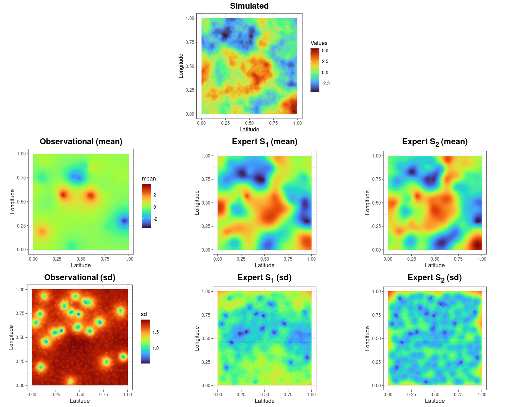{.absolute top="370" left="700" width="500"}

## {.smaller}
### Compositional Data

In this example, we consider a simulated dataset with **three categories** (corresponding to **two ALR components**) and a **spatio-temporal structure** that falls within a **Big Data setting** and exhibits **changes of spatial support over time**. The underlying model is defined through a **continuous Gaussian random field**, which is **integrated over space according to the spatial support associated with each temporal node**.
$$
\begin{array}{rcl}
\mu_{it1} = \beta_{01} + \int_{\mathbf{s}\in C_i}u_1(\mathbf{s},t)\text{d}\mathbf{s} + u_{it}, \\
\mu_{it2} = \beta_{02} + \int_{\mathbf{s}\in C_i}u_2(\mathbf{s},t)\text{d}\mathbf{s} + u_{it}. \\
\end{array}
$$

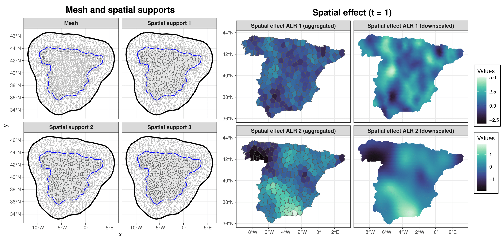{.absolute left="250" width="800"}

# Conclusions and future research lines

## Conclusions {.smaller}

This thesis develops **methodological and computational contributions**, together with **applied implementations**, to address challenges related to the **transfer and sharing of information across statistical models**, enabling **efficient Bayesian inference in complex spatio-temporal settings** and challenges that arise in spatio-temporal analysis of CoDa. Specifically, the thesis:

- proposes **novel strategies and algorithms** for information updating, including **recursive and distributed inference frameworks** within the INLA method;
- introduces a **Shiny application** for spatial analysis that also enables the use of **Bayesian Feedback**;
- addresses **key challenges in CoDa**, including the presence of zeros, change of support, and Big Data settings; and
- develops an approach for **integrating expert knowledge**, explicitly accounting for **change of support issues**.

<!-- This thesis develops **methodological frameworks for transferring information across inferential procedures using sequential and distributed inference**, applicable to both partitioned and partially overlapping models that share common components. These approaches enable **joint learning from different sources** and **provide practical solutions for computationally intensive inference** arising from large datasets or complex model structures. Within this framework, the thesis introduces **Bayesian feedback mechanisms**, **sequential consensus algorithms**, and **recursive and distributed inference** procedures, and applies them to spatial and spatio-temporal modeling, **addressing key challenges in compositional data analysis**, including the presence of 0's, Big Data settings and change of spatial support, with demonstrated applications to large-scale land-use data through downscaling models. -->

<!-- Specifically, the thesis: -->

<!-- - proposes **novel strategies and algorithms** for information updating, including **recursive and distributed inference frameworks** within the INLA method; -->
<!-- - introduces a **Shiny application** for spatial analysis that also enables the use of **Bayesian Feedback**; -->
<!-- - addresses **key challenges in CoDa**, including the presence of zeros, change of support, and Big Data settings; and -->
<!-- - develops an approach for **integrating expert knowledge**, explicitly accounting for **change of support issues**. -->

## Future research lines {.smaller}

Future research directions can be organized into two areas: **advances in distributed inference** and a set of **secondary research lines**.

Regarding improvements to distributed inference, three main developments are envisaged:

- the use of **generalized skew-normal approximations** for the **joint marginal** distribution **of the hyperparameters**;
- the **identification of the proper mode** in a distributed setting by directly optimizing $\tilde{\pi}_d(\boldsymbol\theta \mid \mathbf{y})$; and
- the **improvement of the hyperparameters marginals** by **exploiting asymmetric Gaussian marginal corrections** of the joint marginal distribution, **combined with consensus strategies based on sampling** from these asymmetric approximations across partitions.

The minor research lines include:

- the **development of spatial models on non-trivial and cost-based geometries** using topology-adapted SPDE–FEM meshes, together with the implementation of the necessary functions to perform this analysis;
- **extensions of sequential consensus algorithms** through joint and asymmetric hyperparameter priors to improve robustness and information transfer;
- the **expansion and validation** of the `dirinla` package to **support the full range of INLA random effects**; and
- the design of **graph-geometry-aware matrix storage formats** to improve memory efficiency and scalability in large graphical models.

## {background-image="./Figures/Title_Page_Thesis.png"}

<!-- # Supplementary Slides -->

<!-- ## Sequential consensus algorithms -->

<!-- 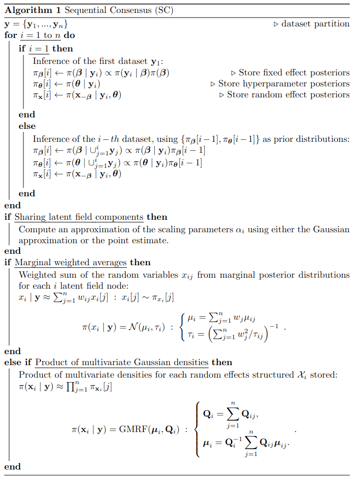{.absolute top="0" right="350" width="550" height="750"} -->

<!-- :::{.fragment} -->
<!-- 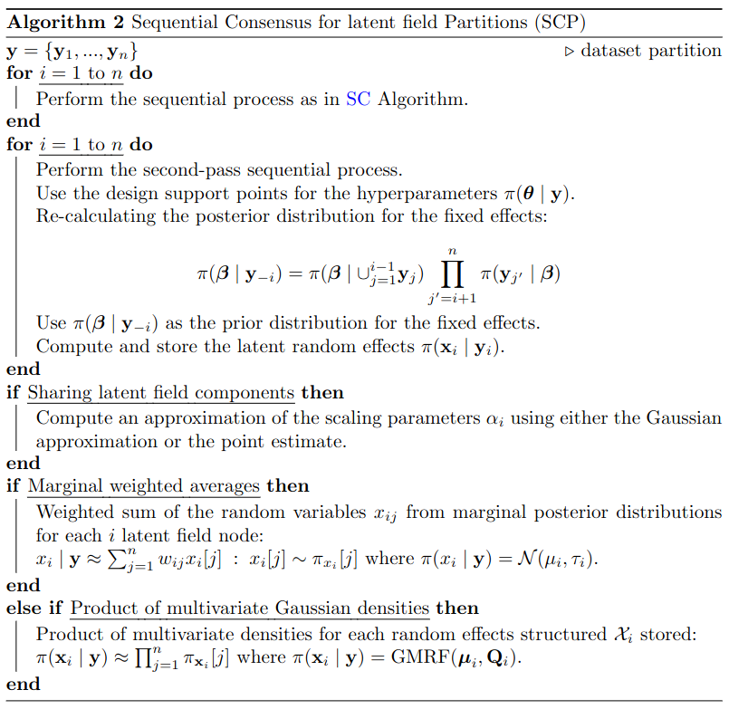{.absolute top="0" right="350" width="650" height="750"} -->
<!-- ::: -->

<!-- ## Differences and connections between distributed and recursive inference {.smaller} -->

<!-- The differences between the two approaches are numerous, as noted both at the beginning of this chapter and throughout its development. Among these, three fundamental connections can be highlighted: -->

<!-- - in both approaches, the *inference procedure* is **divided into two main pieces**; -->
<!-- - both employ exactly the same procedure to compute the **joint marginal and marginal posterior distributions of the hyperparameters**; -->
<!-- - since any distributed approach can be executed recursively, an equivalence can be established whereby the **order dependence of the recursive algorithm is eliminated**. -->

<!-- However, there are also substantial differences between the two procedures. In particular: -->

<!-- - the computation of the **conditional posterior of the latent field**, and consequently of the **marginal of the conditional posterior**, can be carried out differently; -->
<!-- - the resulting **marginal posterior distributions of the latent field nodes** differ between the two approaches. -->

<!-- ## References -->

